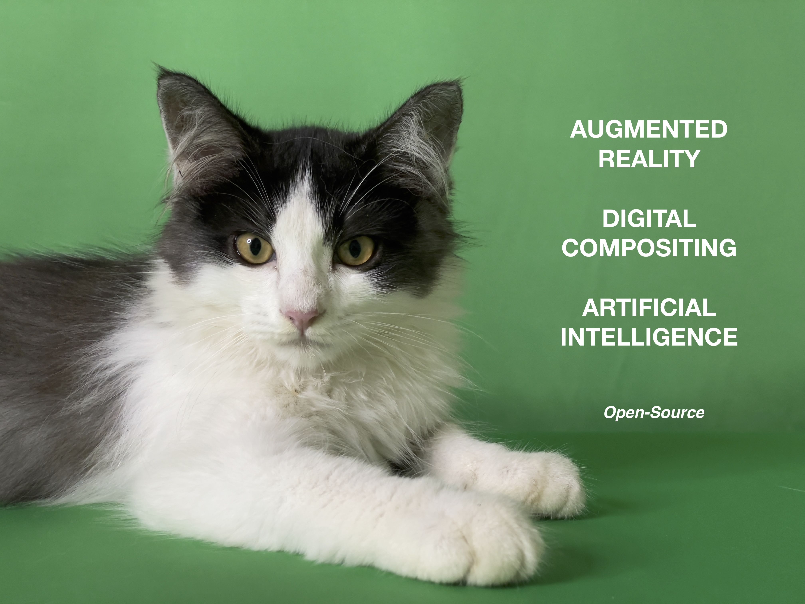

# Agile Digital Compositing workflow for mobile Photo & Video Editor

Digital Compositing (node-based) is the process of combining multiple seemingly simple nodes to render and achieve a desired result. The paradigm of a node-based tool involves linking basic media objects onto a procedural map or node graph and then intuitively laying out each of the steps in a sequential progression of inputs and outputs. Any parameters from an earlier step can be modified to change the outcome, with the results instantly being visible to you, and each of the nodes, being procedural, can be easily reused, saving time and effort.

This repo proposes the idea of **displaying a digital compositing node graph succinctly as a list of steps**. A list of steps is easy to understand due to its sequential nature and a succinct medium for display on a device with a limited screen space (mobile phone). It is also easy to create and can be conveniently typed into a document or used for discussion in a book.

## TL;DR

     Read photo  Read photo
     |           |     
     V           V     
     Exposure    Color Correction 
     |           |
     |           V
     |           Retouch
     |           |
     |           V
     |           Gaussian Blur
     |           |
     V           V
         Merge
           |
           V
         Viewer
         
to

    1. Read photo       
    2. Exposure         (1)    
  
    3. Read photo       
    4. Color Correction (3)     
    5. Retouch          (4)     
    6. Gaussian Blur    (5)     
  
    7. Merge            (2,6)  
    8. Viewer           (7)     

Note - The brackets e.g. "(1)" refers to the input node or image.

## Proposed Idea: Node graph as a list of steps

*'In nova fert animus mutatas dicere formas
corpora; di, coeptis (nam vos mutastis et illas)
adspirate meis primaque ab origine mundi
ad mea perpetuum deducite tempora carmen. (Ovid)'* 

* Background: [Digital Compositing on Mobile](documentation/NodeBasedCompositingOnMobile.md)
* [Digital Compositing Pipeline](documentation/NodePipeline.md) for representing Node Graph
* [Auto Chaining](documentation/AutoChaining.md) & [Reverse Compositing](documentation/ReverseCompositing.md)
* Node and Position Reference
* [Viewer Cycling](documentation/ViewerCycling.md)
* [Metamorphosis](documentation/Metamorphosis.md) - Under Construction
* [Direct Acyclic Graph Generation](documentation/DirectedAcyclicGraphGeneration.md)

## Advantages of Digital Compositing Pipeline
* [Elegant Simplicity of a Digital Compositing Pipeline](documentation/DigitalCompositingPipelineAdvantages.md) - Under Construction

## Open-Source Projects (GPLv2)

The latest source code is in ShaderMuse. 

* [Video Editor](https://photorealityar.com/videoeditorsdk.html) - Reality ^Cat Cut AR Movie Maker.
  
  
  
* [Stable Diffusion Cat Animator](https://photorealityar.com/stablediffusioncatanimator.html) - Use Artificial Intelligence and a base kitten video to drive animations of a cartoon cat, an owl, and a racoon.
* [RealityKit Terrain Shader](https://github.com/Misfits-Rebels-Outcasts/RealityKit-Terrain-Shader) - Use Fractal Brownian Motion (fBM) to generate an Augmented Reality (AR) Terrain using iOS RealityKit Custom Materials.
* [Photo Curves](https://github.com/Misfits-Rebels-Outcasts/Photo-Curves) - Photo Curves, Tone Curves, and RGB Curves component.
* [ShaderMuse](https://github.com/Misfits-Rebels-Outcasts/ShaderMuse) - Digital Compositing Shaders, Filters, and Effects (Source v0.2).
* [Library for Chaining, Blending, and Compositing Core Image CIFilter](documentation/ChainingBlendingCompositingCoreImageCIFilters.md) 
* [SwiftUI WYSIWYG Draw](https://github.com/Misfits-Rebels-Outcasts/SwiftUI-WYSIWYG-Draw) for Nodef in the future.
* [Photo Filters & Effects](code/Nodef) - Source Code for v0.1 [Notes](code/Readme.md)
* [Photo Reality AR](https://photorealityar.com) - Augmented Reality Photo AR.

Platform
* iOS, iPadOS, Mac, or xrOS with Swift and Metal

## Free App in App Store

* [Reality ^Cat Cut - Video Editor](https://apps.apple.com/us/app/reality-cat-cut-video-editor/id6470134946)

  

* [Pipeline: Digital Compositing](https://apps.apple.com/us/app/pipeline-digital-compositing/id1640788489)

  
     
## Videos

* [Shaders and Filters](https://www.youtube.com/shorts/8rLejlmGEKI)

* [Add a Smoke Effect to a Photo](https://www.youtube.com/watch?v=tvza2kf4cDQ)

* [Photo Filters & Effects](https://www.youtube.com/watch?v=dlnh_09_rvA)

## Open Digital Compositing Pipeline

by Nodef - No definition or node definition.

